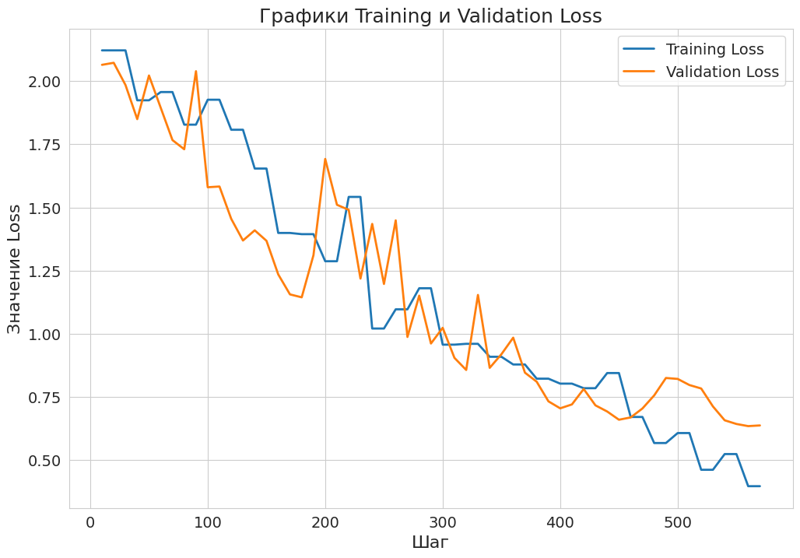

# VK-Voice-AI-Research-2023
## Содержимое репозитория
1) model - в этой папке содержаться файлы обученной модели, кроме одного, который можно скачать по этой ссылке:  
https://drive.google.com/open?id=1C2snmPVjC81AqJTtmsIFG9o6Equ_pFSx&usp=drive_fs  
Также в этой папке содержиться блокнот "model_train.ipynb" с тренировочной моделью
2) 

### Плюсы и минусы решения задачи классификации эмоций в аудио с помощью wav2vec2.0. 
#### Плюсы
* Это предобученная модель, что позволяет использовать небольшой набор данных для обучения
* Качество распознавания речи: Wav2Vec2 обладает высокой точностью в распознавании речи, что может быть важным, при анализе аудиофайлов в контексте определения эмоций
* XLSR-Wav2Vec2 является мультязыковой моделью, что позволяет легко и быстро настроить модель на разные языки, скачав соответствующую языковую модель XLSR (есть даже на татарском)

#### Минусы
* Предназначение для распознавания речи: Wav2Vec 2.0 был разработан для преобразования аудио в текст, и его основной целью является извлечение текстовой информации из аудиофайлов. Он не обучен напрямую классифицировать эмоции.
* Необходимость использовать XSLR модель
* Необходимость писать свой классификатор

### Обоснованность данного решения
Это решение было выбрано ввиду его доступности: ссылка на похожую модель, но для греческого языка была на главной странице Hugging face wav2vec2. Изачально планировалось взять эту модель как baseline, однако настройка модели для этих данных заняла некоторое время: например, в данном решении был использован resampler от librosa, а не torchaudio.  
Ссылки:  

[Emotion_recognition_in_Greek_speech_using_Wav2Vec2](https://colab.research.google.com/github/m3hrdadfi/soxan/blob/main/notebooks/Emotion_recognition_in_Greek_speech_using_Wav2Vec2.ipynb#scrollTo=4TkGYrVTFR6Y)  
[wav2vec 2.0: A Framework for Self-Supervised
Learning of Speech Representations](https://arxiv.org/pdf/2006.11477.pdf)  
[xlsr_wav2vec2](https://huggingface.co/docs/transformers/model_doc/xlsr_wav2vec2)  
[wav2vec2](https://huggingface.co/docs/transformers/model_doc/wav2vec2)  

### Особенности датасета RAVDESS и разделение датасета на train val  
Особенности:  
* 24 актера озвучки с нейтральным северо-американским акцентом
* 8 различных эмоций
* Различная интенсивность (сила) голоса
* По две записи каждой эмоции
* Две разных фразы ("Kids are talking by the door", "Dogs are sitting by the door")  

Разделение происходило с помощью обычного train_test_split с соотношением 80/20, со стратификацией по эмоциям и random_state=101.

### Таблицы с метриками  
<figure>
  
  <figcaption>Таблица 1 - Метрики, посчитанные на валидацинном датасете</figcaption>
</figure>  

### График обучения модели
<figure>
  
  <figcaption>Рисунок 1 - Графики потерь на тренировочных и валидационных данных</figcaption>
</figure>  

### Идеи по дальнейшему решению задачи
1) Попробовать различные стратегии слияния для (merge strategies) для XLSR модели
2) Попробовать более экстрмеальные параметры обучения (уменьшить размер батча, увеличить per_device_eval_batch_size)
3) Использовать для сравнения другие модели, такие как:
   + DeepMoji
   + OpenSMILE
   + Affective Computing с использованием Convolutional Neural Networks
   + EmoReact
   + VGGish 

